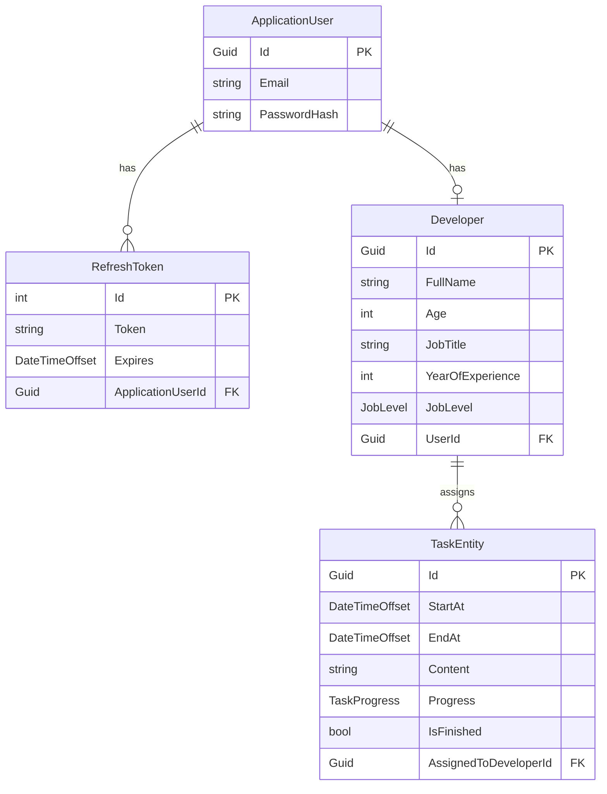

# TaskFlow: Developer Task Management API

## Overview

**TaskFlow** is a robust, clean-architecture-based API designed for managing developer tasks and profiles. It provides a structured backend for assigning, tracking, and managing the workflow of development tasks within a team. Built on **ASP.NET Core**, the application adheres to modern software design principles, including Domain-Driven Design (DDD) concepts, separation of concerns, and a strong emphasis on maintainability, testability, and security.

The API is fully versioned and includes comprehensive features for user authentication (JWT and Refresh Tokens), developer profile management, and task lifecycle control.

## Key Features

- **Clean Architecture:** Structured into distinct layers (`API`, `Business`, `Core`, `Domain`, `Infrastructure`, `Shared`) for clear separation of concerns.
- **Identity and Authentication:** Secure user management using ASP.NET Core Identity, supporting role-based authorization (`Admin`, `Manager`, `Developer`).
- **JWT and Refresh Token Management:** Implements secure token-based authentication with a dedicated mechanism for refreshing expired access tokens.
- **Developer Management:** CRUD operations for managing developer profiles, including details like job title, experience, and job level.
- **Task Management:** Full lifecycle management for tasks, including assignment, status tracking (`Started`, `InProgress`, `Blocked`, `Completed`), and update capabilities.
- **API Versioning:** Supports multiple API versions, currently implemented for `v1.0`.
- **Observability:** Integrated logging via **Serilog** and distributed tracing via **OpenTelemetry**.
- **Data Validation:** Uses **FluentValidation** for robust, centralized input validation.

## Entity Relationships

The core domain model revolves around three main entities: `ApplicationUser`, `Developer`, and `TaskEntity`.

| Entity              | Description                                                                                 | Key Attributes                                                       | Relationships                                                |
| :------------------ | :------------------------------------------------------------------------------------------ | :------------------------------------------------------------------- | :----------------------------------------------------------- |
| **ApplicationUser** | Extends `IdentityUser`. The core identity entity used for authentication and authorization. | `Email`, `PasswordHash`, `Roles`, `RefreshTokens`                    | **1:1** with `Developer`                                     |
| **Developer**       | Represents a developer profile in the system. Linked to an `ApplicationUser`.               | `FullName`, `Age`, `JobTitle`, `YearOfExperience`, `JobLevel` (Enum) | **1:1** with `ApplicationUser`, **1:Many** with `TaskEntity` |
| **TaskEntity**      | Represents a single development task.                                                       | `StartAt`, `EndAt`, `Content`, `Progress` (Enum), `IsFinished`       | **Many:1** with `Developer` (AssignedToDeveloper)            |
| **RefreshToken**    | Used to generate new JWTs without re-authenticating.                                        | `Token`, `Expires`, `Created`, `Revoked`                             | **Many:1** with `ApplicationUser`                            |

### Relationship Diagram (Conceptual)

## Technologies Used

| Category              | Technology                        | Purpose                                                                                |
| :-------------------- | :-------------------------------- | :------------------------------------------------------------------------------------- |
| **Backend Framework** | ASP.NET Core 7/8                  | Core framework for building the Web API.                                               |
| **Language**          | C#                                | Primary programming language.                                                          |
| **Database**          | Entity Framework Core             | Object-Relational Mapper (ORM) for data access.                                        |
| **Identity/Auth**     | ASP.NET Core Identity, JWT Bearer | User authentication, authorization, and token management.                              |
| **Validation**        | FluentValidation                  | Centralized, type-safe input validation.                                               |
| **Mapping**           | AutoMapper                        | Object-to-object mapping (DTOs to Entities and vice-versa).                            |
| **Logging**           | Serilog                           | Structured logging and output to files/console.                                        |
| **Monitoring**        | OpenTelemetry                     | Distributed tracing and observability (configured but requires an external collector). |
| **API Docs**          | Swagger/OpenAPI                   | Automatic API documentation generation and testing interface.                          |

## Technical Highlights

1.  **Repository and Unit of Work Pattern:** The data access layer is abstracted using the Generic Repository and Unit of Work patterns (`TaskFlow.Core/IRepositories`, `TaskFlow.Infrastructure/Repositories`, `TaskFlow.Infrastructure/Unit`), ensuring clean separation from business logic.
2.  **Domain-Driven Design (DDD) Entities:** Entities like `Developer` and `TaskEntity` contain business logic (e.g., `SetFullName`, `MarkAsFinished`) and enforce invariants through private setters and validation within their methods, promoting a robust domain model.
3.  **Custom Middleware and Filters:** Includes `ErrorHandlingMiddleware` for consistent global exception handling and `RequestTimeCalculationFilter` for performance monitoring.
4.  **Configuration Management:** Uses the Options Pattern (`OptionsPatternExtension.cs`) to strongly type configuration settings.

## Key Use Cases

| Use Case                 | Description                                                                           | Primary Roles             |
| :----------------------- | :------------------------------------------------------------------------------------ | :------------------------ |
| **User Authentication**  | Logging in, refreshing JWT tokens, and managing forgotten/reset passwords.            | Developer, Admin, Manager |
| **Developer Onboarding** | Creating new developer profiles and linking them to a system user account.            | Admin                     |
| **Task Assignment**      | Creating a new task with content, timeline, and assigning it to a specific developer. | Admin                     |
| **Task Tracking**        | Developers updating the status (`Progress`) of their assigned tasks.                  | Developer, Admin, Manager |
| **Profile Management**   | Admins/Managers updating developer details (e.g., job title, experience).             | Admin, Manager            |
| **Reporting/Overview**   | Retrieving paginated lists of all developers or tasks, or filtering tasks by status.  | Admin, Manager            |

## API Documentation

All endpoints are versioned under `v1.0` and require a valid JWT Bearer token in the `Authorization` header unless specified otherwise (e.g., `login`, `forgot-password`).

### 1. Authentication Endpoints (`/api/v1/Authentication`)

| Action                   | HTTP Method | Route                   | Description                                                                        | Authorization |
| :----------------------- | :---------- | :---------------------- | :--------------------------------------------------------------------------------- | :------------ |
| **Login**                | `POST`      | `/login`                | Authenticates a user and returns JWT and Refresh Token.                            | None          |
| **Forgot Password**      | `POST`      | `/forgot-password`      | Initiates password reset by generating a token for the user's email.               | None          |
| **Reset Password**       | `POST`      | `/reset-password`       | Resets the user's password using a valid reset token.                              | None          |
| **Refresh Token**        | `POST`      | `/refresh-token`        | Generates a new JWT and Refresh Token pair using a valid, unexpired Refresh Token. | None          |
| **Revoke Refresh Token** | `PUT`       | `/revoke-refresh-token` | Invalidates a specific Refresh Token.                                              | None          |

#### API Details

| Endpoint                      | Purpose                       | Inputs                                                           | Outputs                                                    | Example Usage                                                                     |
| :---------------------------- | :---------------------------- | :--------------------------------------------------------------- | :--------------------------------------------------------- | :-------------------------------------------------------------------------------- |
| **POST /login**               | Authenticates user.           | `LoginRequest` (Email, Password)                                 | `LoginResponse` (JWT, Refresh Token, Expiry, User details) | `{"email": "user@taskflow.com", "password": "Password123"}`                       |
| **POST /forgot-password**     | Request password reset token. | `ForgotPasswordRequest` (Email)                                  | `string` (The generated reset token)                       | `{"email": "user@taskflow.com"}`                                                  |
| **POST /reset-password**      | Reset password.               | `ResetPasswordRequest` (Email, Token, NewPassword)               | `bool` (Success status)                                    | `{"email": "user@taskflow.com", "token": "...", "newPassword": "NewPassword123"}` |
| **POST /refresh-token**       | Get new tokens.               | `RefreshTokenRequest` (Expired JWT `Token`, `RefreshToken`)      | `LoginResponse` (New JWT/Refresh Token pair)               | `{"token": "...", "refreshToken": "..."}`                                         |
| **PUT /revoke-refresh-token** | Revoke token.                 | `RefreshTokenRequest` (Access `Token`, `RefreshToken` to revoke) | `bool` (Success status)                                    | `{"token": "...", "refreshToken": "..."}`                                         |

### 2. Account Endpoints (`/api/v1/Accounts`)

| Action              | HTTP Method | Route              | Description                                                   | Authorization      |
| :------------------ | :---------- | :----------------- | :------------------------------------------------------------ | :----------------- |
| **Change Password** | `POST`      | `/change-password` | Allows the currently logged-in user to change their password. | Authenticated User |

#### API Details

| Endpoint                  | Purpose                         | Inputs                                                 | Outputs                 | Example Usage                                                               |
| :------------------------ | :------------------------------ | :----------------------------------------------------- | :---------------------- | :-------------------------------------------------------------------------- |
| **POST /change-password** | Change current user's password. | `ChangePasswordRequest` (CurrentPassword, NewPassword) | `bool` (Success status) | `{"currentPassword": "OldPassword123", "newPassword": "StrongPassword456"}` |

### 3. Developer Endpoints (`/api/v1/Developers`)

| Action        | HTTP Method | Route            | Description                                                    | Authorization  |
| :------------ | :---------- | :--------------- | :------------------------------------------------------------- | :------------- |
| **Get All**   | `GET`       | `/`              | Retrieves a paginated list of all developer profiles.          | Admin          |
| **Get By ID** | `GET`       | `/{id:guid}`     | Retrieves a specific developer profile by ID.                  | Admin          |
| **Create**    | `POST`      | `/`              | Registers a new developer profile and associated user account. | Admin          |
| **Update**    | `PUT`       | `/`              | Updates the details of an existing developer profile.          | Admin, Manager |
| **Delete**    | `DELETE`    | `/{developerId}` | Deletes a developer profile by ID.                             | Admin, Manager |

#### API Details

| Endpoint                  | Purpose               | Inputs                                                                                                                           | Outputs                           | Example Usage                                                    |
| :------------------------ | :-------------------- | :------------------------------------------------------------------------------------------------------------------------------- | :-------------------------------- | :--------------------------------------------------------------- |
| **GET /**                 | Get paginated list.   | Query: `pageIndex` (int, default 1), `pageSize` (int, default 10)                                                                | `PagesResult<DeveloperViewModel>` | `GET /api/v1/Developers?pageIndex=2&pageSize=5`                  |
| **GET /{id}**             | Get single developer. | Path: `id` (GUID)                                                                                                                | `DeveloperViewViewModel`          | `GET /api/v1/Developers/a1b2c3d4-e5f6-7890-1234-567890abcdef`    |
| **POST /**                | Create new developer. | Form Data: `CreateDeveloperRequest` (FullName, Age, JobTitle, YearOfExperience, JobLevel, Email, Password, ImageFile (optional)) | `bool` (Success status)           | (Multi-part form data submission)                                |
| **PUT /**                 | Update developer.     | Form Data: `UpdateDeveloperRequest` (DeveloperId, FullName, Age, JobTitle, YearOfExperience, JobLevel, ImageFile (optional))     | `bool` (Success status)           | (Multi-part form data submission)                                |
| **DELETE /{developerId}** | Delete developer.     | Path: `developerId` (GUID)                                                                                                       | `bool` (Success status)           | `DELETE /api/v1/Developers/a1b2c3d4-e5f6-7890-1234-567890abcdef` |

### 4. Task Endpoints (`/api/v1/Tasks`)

| Action                  | HTTP Method | Route                   | Description                                                                  | Authorization    |
| :---------------------- | :---------- | :---------------------- | :--------------------------------------------------------------------------- | :--------------- |
| **Assign Task**         | `POST`      | `/`                     | Creates and assigns a new task to a developer.                               | Admin            |
| **Change Status**       | `PATCH`     | `/{taskId:guid}/status` | Updates the `Progress` status of a task.                                     | Admin, Developer |
| **Delete Task**         | `DELETE`    | `/{taskId:guid}`        | Deletes a task by ID.                                                        | Admin            |
| **Get Task By ID**      | `GET`       | `/{taskId:guid}`        | Retrieves a single task by ID.                                               | Admin, Developer |
| **Get Developer Tasks** | `GET`       | `/developer`            | Retrieves paginated tasks assigned to the currently authenticated developer. | Developer        |
| **Get Admin Tasks**     | `GET`       | `/admin`                | Retrieves paginated list of all tasks in the system.                         | Admin            |
| **Get Tasks By Status** | `GET`       | `/by-status`            | Retrieves paginated tasks filtered by a specific `TaskProgress` status.      | Admin, Manager   |
| **Update Task Details** | `PUT`       | `/`                     | Updates the content, timeline, or developer assignment of an existing task.  | Admin, Manager   |

#### API Details

| Endpoint                   | Purpose                     | Inputs                                                                                  | Outputs                            | Example Usage                                                                                                                                                      |
| :------------------------- | :-------------------------- | :-------------------------------------------------------------------------------------- | :--------------------------------- | :----------------------------------------------------------------------------------------------------------------------------------------------------------------- |
| **POST /**                 | Assign new task.            | Body: `CreateTaskEntity` (AssignedToDeveloperId, StartAt, EndAt, Content, Progress)     | `TaskEntityViewModel`              | `{"assignedToDeveloperId": "...", "startAt": "2025-10-25T09:00:00Z", "endAt": "2025-10-26T17:00:00Z", "content": "Implement feature X", "progress": "NotStarted"}` |
| **PATCH /{taskId}/status** | Update task status.         | Path: `taskId` (GUID). Query: `progress` (TaskProgress Enum)                            | `bool` (Success status)            | `PATCH /api/v1/Tasks/1234.../status?progress=InProgress`                                                                                                           |
| **DELETE /{taskId}**       | Delete task.                | Path: `taskId` (GUID)                                                                   | `bool` (Success status)            | `DELETE /api/v1/Tasks/1234...`                                                                                                                                     |
| **GET /{taskId}**          | Get single task.            | Path: `taskId` (GUID)                                                                   | `TaskEntityViewModel`              | `GET /api/v1/Tasks/1234...`                                                                                                                                        |
| **GET /developer**         | Get tasks for current user. | Query: `pageNumber`, `pageSize`                                                         | `PagesResult<TaskEntityViewModel>` | `GET /api/v1/Tasks/developer?pageNumber=1`                                                                                                                         |
| **GET /admin**             | Get all tasks.              | Query: `pageNumber`, `pageSize`                                                         | `PagesResult<TaskEntityViewModel>` | `GET /api/v1/Tasks/admin?pageNumber=1`                                                                                                                             |
| **GET /by-status**         | Filter tasks by status.     | Query: `progress` (TaskProgress Enum), `pageNumber`, `pageSize`                         | `PagesResult<TaskEntityViewModel>` | `GET /api/v1/Tasks/by-status?progress=Completed&pageSize=5`                                                                                                        |
| **PUT /**                  | Update task details.        | Body: `UpdateTaskEntity` (Id, AssignedToDeveloperId, StartAt, EndAt, Content, Progress) | `TaskEntityViewModel`              | `{"id": "...", "content": "Updated content", ...}`                                                                                                                 |

---
